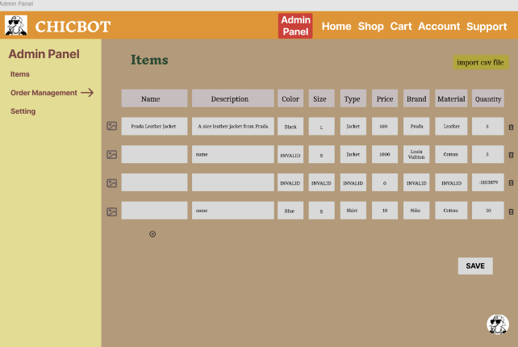

# ChicBot: System Design Document

## Introduction

### Purpose of System
This project aims to develop an inventory management system for small to medium-sized clothing businesses. The system streamlines inventory management and enhances customer interaction through a chatbot named ChicBot, powered by a large language model (LLM). ChicBot answers inventory-related queries and provides personalized clothing recommendations, improving user experience, reducing search time, and boosting business revenue through efficient customer engagement.

### Design Goals

#### Performance
- Respond to user interactions (e.g., button clicks, filters) within 1-2 seconds.
- Database queries (e.g., clothing item searches) return results in ≤3 seconds.
- Optimize resource usage for efficient memory and smooth performance across platforms.

#### Dependability
- Ensure stability for concurrent user interactions without lag.
- Handle valid and invalid inputs, displaying error messages for unrecognized requests.
- Implement security protocols for user data protection during login and checkout.
- ChicBot remains consistently available across all pages.

#### Cost
- Leverage existing libraries and an LLM to minimize development costs.
- Assess scalability costs for future expansion to larger retailers or platforms (Android, iOS, desktop).
- Initial deployment will be web-based or mobile-compatible.

#### Maintenance
- Use modular design with clear class inheritance and separation of concerns.
- Provide detailed documentation for architecture and components.
- Enable incremental updates with minimal disruption to core functionality.
- Ensure readable code for easy debugging.

#### End User Criteria
- Offer a user-friendly GUI with intuitive navigation.
- Provide quick access to filters (color, size, type, brand) and an interactive search bar.
- Include ChicBot for query assistance and personalized recommendations.
- Allow easy profile updates, security settings, and order history access.
- Implement a password-protected payment section for secure transactions.

### Definitions, Acronyms, and Abbreviations
- **LLM**: Large Language Model - AI for processing and generating human-like text.
- **GUI**: Graphical User Interface.
- **API**: Application Programming Interface - Protocols for software component interaction.
- **CSV**: Comma-Separated Values - Tabular data storage format.
- **ChicBot**: LLM-powered chatbot for user queries and clothing recommendations.
- **IDE**: Integrated Development Environment.
- **C++**: High-level programming language.
- **UI**: User Interface.
- **OS**: Operating System.

## Proposed Software Architecture

### Overview
ChicBot’s architecture uses an agentic LLM process with two API calls:
1. **Structured Output**: Processes user input, extracts clothing-related data into JSON, and appends to conversation history.
2. **Conversational Agent**: Uses structured data and database matches to generate personalized recommendations.

The system ensures modularity, error handling, and efficient resource use.

### Subsystem Decomposition
The system comprises three main components:

#### LLM Module
- **Structured Model**: Extracts and categorizes user input.
- **Conversational Model**: Handles general conversation as ChicBot.
- Uses in-memory volatile storage for previous queries to personalize outputs.

#### User Interface (UI) Module
- Features a login page for user accounts.
- Allows text-based clothing queries via a terminal, with ChicBot providing recommendations.
- Supports cart management and profile updates (name, email, address, password, payment).

#### Database Module
- Uses a CSV file for inventory data (size, color, material, price, etc.).
- Each row represents a unique item; columns store attributes.
- Requires regular updates for accurate inventory and pricing.

### Hardware/Software Mapping
- Users interact with ChicBot via a text terminal in the UI.
- Two API calls:
  1. Maps user input to the LLM, extracting attributes (type, material, color, size) and using past queries for personalization.
  2. Queries the CSV database to retrieve matching items based on user history.
- Keywords are filtered into database categories for matching.

### Persistent Data Management
- **Database**: CSV file with columns for clothing attributes (color, size, brand, material). Each row is a unique item.
- **In-Memory**: Stores user queries in volatile memory for LLM personalization. Ignores inputs without relevant keywords to maintain data relevancy.

### Access Control and Security
- Backend handles sensitive operations (recommendations, database queries) to prevent tampering.
- Token-based authentication ensures only authorized users access API responses.
- Curl operations encrypt input/output data in HTTP requests for secure transfer.

### Global Flow Control

- **API Flow**: Sequential calls:
  1. First call fetches and parses clothing details. On failure, logs parsing errors and continues.
  2. Second call uses parsed data and database to generate recommendations. On failure, logs errors and skips to the next iteration.
- Ensures smooth flow without interrupting the main loop.

### Boundary Conditions
- **User Input**: Must not be empty or invalid (no enumeration assignments). Max 1024 tokens, English only.
- **API**: Handles timeouts, latency, and errors with retries.
- **Database**: Requires relevant, frequently updated data. Includes error handling for temporary unavailability.

## Subsystem Services
The system includes five subsystems:

1. **Customer Management**:
   - Handles registration, login, and profile updates.
   - Registration checks for unique usernames; passwords entered twice.
   - Login authenticates username/password.
   - Profile updates include address, postal code, or password changes.
   - Independent of other subsystems.

   

2. **Order Placement**:
   - Users browse products, add items to cart (if in stock, checked via item ID).
   - Checkout verifies stock and processes payment.
   - Depends on inventory management (availability) and customer management (cart/order linking).

   

3. **Inventory Management**:
   - Tracks stock, allowing users to add/remove items.
   - Automatically updates inventory on purchase.
   - Greys out “Add to Cart” for out-of-stock items.
   - Depends on customer management for cart-related functions.

   

4. **LLM Bot Interaction**:
   - ChicBot filters clothes by metadata (size, color, brand) and supports multiple filters.
   - Provides outfit recommendations based on inventory and customer order history.
   - Depends on inventory and customer management subsystems.

   

## Diagrams

### Use Case Diagram

### Class Case Diagram
*Assumption*: GUI-related object models are excluded from the class diagram.

## GUI Screenshots

## Project Overview

### Coding Assignments
- **Lead Programmer & LLM Integration**: Reuben
- **Database Management and Backend Developer**: Lucas
- **GUI Development**: Rhiannon
- **Testing & Final Integration**: Ben, Jack, David, Eric

### Timeline

